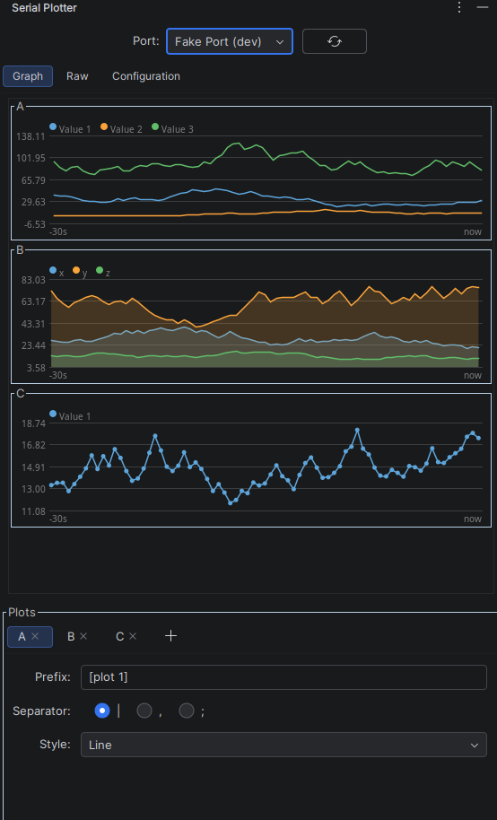
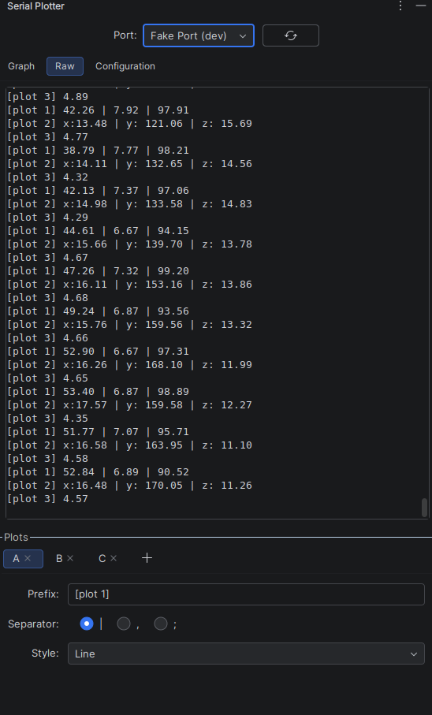

# Serial Plotter

An IntelliJ Platform plugin that reads line-based text from a serial port and plots it live, right
inside the IDE — similar to the Arduino IDE's Serial Plotter, but with multiple independently
configurable plots and labeled series.

## Screenshots

| Live graphs                                      | Raw stream                                                |
|--------------------------------------------------|-----------------------------------------------------------|
|  |  |

## Features

- **Multiple plots** — split the incoming stream into any number of independent charts, each
  matched by its own line prefix (e.g. `[plot 1]`).
- **Multi-value lines** — each line can carry several values at once, separated by `|`, `,`, or
  `;`; every position becomes its own series on the chart.
- **Labeled or positional values** — a token like `x:12.34` is plotted as series `x`.
- **Render styles per plot** — Dots, Line, Filled, Line + Dots, or Filled + Dots.
- **Scrolling oscilloscope-style charts** — a fixed 30-second trailing window.
- **Persistent settings** — the selected port, baud rate, and every plot's configuration are saved
  per-project.

## Usage

1. Open the **Serial Plotter** tool window and pick a port from the **Port** dropdown (use the
   refresh button if your device isn't listed yet).
2. Open the **Configuration** tab and set the baud rate to match your device.
3. In the **Plots** section at the bottom, add one plot per prefix your device emits, and set its **Prefix**, value
   **Separator**, and **Style**.
4. Watch the matching lines appear as live charts in the **Graph** tab, or inspect them unprocessed
   in the **Raw** tab.

### Line format

Each plot only reacts to lines that start with its configured prefix (a plot with an empty prefix
matches every line). The rest of the line is split on the plot's separator, and each resulting
token is either `label:value` or a bare `value`:

```
[plot 1] 42.26 | 7.92 | 97.91
[plot 2] x:13.48 | y: 121.06 | z: 15.69
[plot 3] 4.89
```

With the prefixes `[plot 1]`, `[plot 2]`, and `[plot 3]` configured on three plots, this produces:

- **Plot 1** — three unlabeled series (`Value 1`, `Value 2`, `Value 3`).
- **Plot 2** — three labeled series (`x`, `y`, `z`).
- **Plot 3** — a single unlabeled series.

## Building and running from source

```shell
./gradlew runIde       # launch a sandbox IDE with the plugin installed
./gradlew check        # run tests
./gradlew verifyPlugin # check plugin compatibility
./gradlew buildPlugin  # produce an installable plugin distribution zip
```

The sandbox IDE started via `runIde` runs in a development mode (see `DevMode.kt`) that adds a **Fake Port (dev)** entry
to the port selector, emitting simulated random-walk data on that same
three-plot layout — handy for trying the plugin or working on the graph rendering without real
hardware attached.

To install a locally built plugin into your own IDE instead, run `./gradlew buildPlugin` and
install the resulting zip from `build/distributions` via **Settings/Preferences → Plugins → ⚙ → Install Plugin from
Disk…**.

## Project structure

```
.
├── .run/                   Predefined Run/Debug configurations
├── gradle/
│   ├── wrapper/            Gradle wrapper
│   └── libs.versions.toml  Version catalog
├── src/main/
│   ├── kotlin/             Plugin sources (tool window, port I/O, plotting, settings)
│   └── resources/
│       ├── META-INF/       plugin.xml and plugin icon
│       └── messages/       UI text bundle
├── build.gradle.kts        Gradle build configuration
├── CHANGELOG.md
└── settings.gradle.kts     Gradle project settings
```

Key classes:

| Class                                                   | Responsibility                                                                 |
|---------------------------------------------------------|--------------------------------------------------------------------------------|
| `SerialPlotterToolWindowFactory` / `SerialPlotterPanel` | Wires up the tool window and the port dropdown                                 |
| `PortConnection`                                        | Reads lines from a serial port on a background thread, with retry/reconnect    |
| `PlotsPanel` / `PlotConfigPanel`                        | The "Plots" editor: prefixes, separators, render styles                        |
| `Plot` / `TimeSeries`                                   | Parses matching lines into per-position series and keeps their trailing window |
| `GraphPanel` / `PlotGraphView`                          | Renders the scrolling charts and the raw log                                   |
| `SerialConfigPanel`                                     | Baud rate configuration                                                        |
| `SerialPlotterSettings`                                 | Persists port, baud rate, and plot configuration across restarts               |
| `FakeSerialPort` / `DevMode`                            | Simulated data source for the `runIde` sandbox                                 |

> [!NOTE]
> This plugin was written with the help of Claude, but every line has been carefully reviewed.

## Useful links

- [IntelliJ Platform SDK][docs]
- [IntelliJ Platform Gradle Plugin Documentation][docs:intellij-platform-gradle-plugin-docs]
- [jSerialComm][gh:jserialcomm] — the serial I/O library this plugin is built on

[docs]: https://plugins.jetbrains.com/docs/intellij
[docs:intellij-platform-gradle-plugin-docs]: https://plugins.jetbrains.com/docs/intellij/tools-intellij-platform-gradle-plugin.html
[gh:jserialcomm]: https://github.com/Fazecast/jSerialComm
